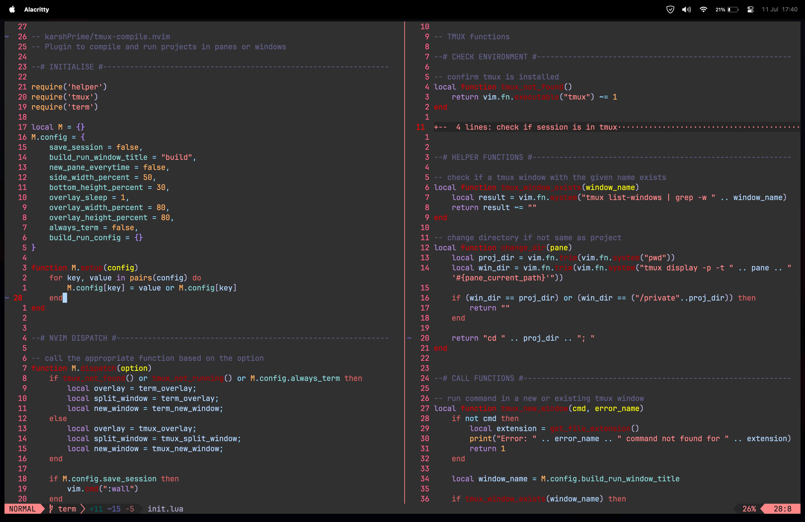
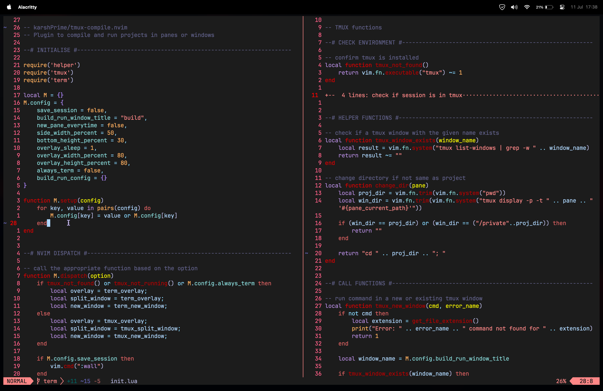
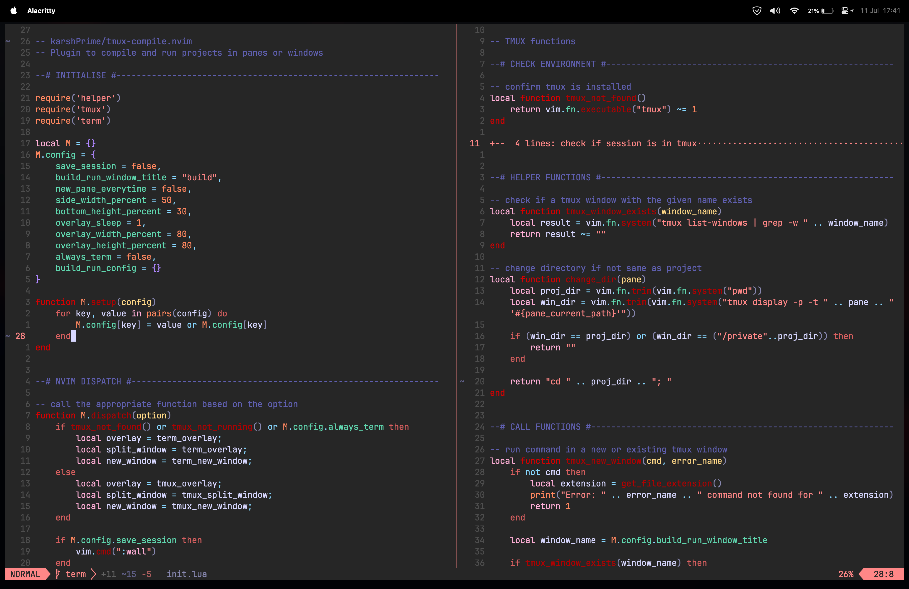
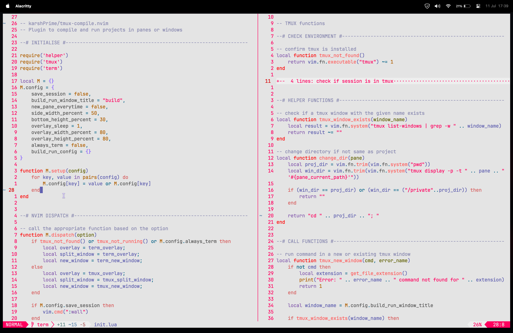
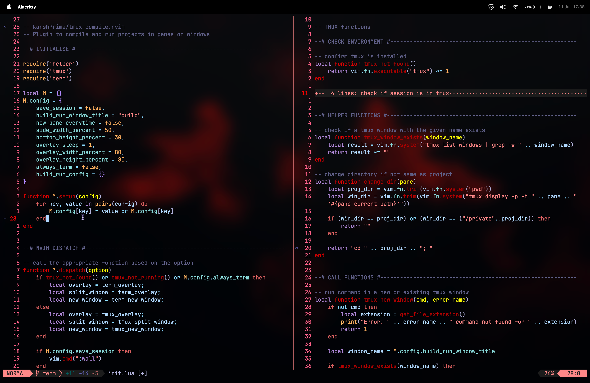

# 🏙 TokyoBurn

A dark and light [Neovim](https://github.com/neovim/neovim) theme written in
[Lua](https://www.lua.org) forked from
[TokyoNight](https://github.com/folke/tokyonight.nvim), which is ported from the
[Visual Studio Code
Tokyonight](https://github.com/enkia/tokyo-night-vscode-theme) theme.

## Storm


## Night


## Moon


## Day


## Transparent


## ✨ Features

- Supports the latest [Neovim](https://github.com/neovim/neovim)
  [0.10.0](https://github.com/neovim/neovim/releases/tag/v0.9.0) features.
- Enhances terminal colors.
- Introduces a darker background option for sidebar-like windows.
- Supports all major plugins.

## ⚡️ Requirements

- [Neovim](https://github.com/neovim/neovim) >=
  [0.8.0](https://github.com/neovim/neovim/releases/tag/v0.8.0)

## 📦 Installation

Install the theme with your preferred package manager, such as
[folke/lazy.nvim](https://github.com/folke/lazy.nvim):

```lua
{
  "karshPrime/tokyoburn.nvim",
  lazy = false,
  priority = 1000,
  opts = {},
}
```

## 🚀 Usage

### Vim Script

```vim
colorscheme tokyoburn

" There are also colorschemes for the different styles.
colorscheme tokyoburn-night
colorscheme tokyoburn-storm
colorscheme tokyoburn-day
colorscheme tokyoburn-moon
```

### [Lua](https://www.lua.org)

```lua
vim.cmd[[colorscheme tokyoburn]]
```

#### External Plugins

##### [Barbecue](https://github.com/utilyre/barbecue.nvim)

```lua
-- Lua
require('barbecue').setup {
  -- ... your barbecue config
  theme = 'tokyoburn',
  -- ... your barbecue config
}
```

##### [Lualine](https://github.com/nvim-lualine/lualine.nvim)

```lua
-- Lua
require('lualine').setup {
  options = {
    -- ... your lualine config
    theme = 'tokyoburn'
    -- ... your lualine config
  }
}
```

##### [Lightline](https://github.com/itchyny/lightline.vim)

```vim
" Vim Script
let g:lightline = {'colorscheme': 'tokyoburn'}
```

## ⚙️ Configuration

> ❗️ Set the configuration **BEFORE** loading the color scheme with `colorscheme tokyoburn`.

The theme offers four styles: [storm](#storm), [moon](#moon), [night](#night),
and [day](#day).

The [day](#day) style is used when `{ style = "day" }` is passed to
`setup(options)` or when `vim.o.background = "light"`.

[TokyoBurn](https://github.com/karshPrime/tokyoburn.nvim) uses the default options,
unless `setup` is explicitly called.

```lua
require("tokyoburn").setup({
  -- your configuration comes here
  -- or leave it empty to use the default settings
  style = "storm", -- The theme comes in three styles, `storm`, `moon`, a darker variant `burn` and `day`
  light_style = "day", -- The theme is used when the background is set to light
  transparent = false, -- Enable this to disable setting the background color
  terminal_colors = true, -- Configure the colors used when opening a `:terminal` in [Neovim](https://github.com/neovim/neovim)
  styles = {
    -- Style to be applied to different syntax groups
    -- Value is any valid attr-list value for `:help nvim_set_hl`
    comments = { italic = true },
    keywords = { italic = true },
    functions = {},
    variables = {},
    -- Background styles. Can be "dark", "transparent" or "normal"
    sidebars = "dark", -- style for sidebars, see below
    floats = "dark", -- style for floating windows
  },
  sidebars = { "qf", "help" }, -- Set a darker background on sidebar-like windows. For example: `["qf", "vista_kind", "terminal", "packer"]`
  day_brightness = 0.3, -- Adjusts the brightness of the colors of the **Day** style. Number between 0 and 1, from dull to vibrant colors
  hide_inactive_statusline = false, -- Enabling this option, will hide inactive statuslines and replace them with a thin border instead. Should work with the standard **StatusLine** and **LuaLine**.
  dim_inactive = false, -- dims inactive windows
  lualine_bold = false, -- When `true`, section headers in the lualine theme will be bold

  --- You can override specific color groups to use other groups or a hex color
  --- function will be called with a ColorScheme table
  ---@param colors ColorScheme
  on_colors = function(colors) end,

  --- You can override specific highlights to use other groups or a hex color
  --- function will be called with a Highlights and ColorScheme table
  ---@param highlights Highlights
  ---@param colors ColorScheme
  on_highlights = function(highlights, colors) end,
})
```

## 🪓 Overriding Colors & Highlight Groups

How the highlight groups are calculated:

1. `colors` are determined based on your configuration, with the ability to
   override them using `config.on_colors(colors)`.
1. These `colors` are utilized to generate the highlight groups.
1. `config.on_highlights(highlights, colors)` can be used to override highlight
   groups.

For default values of `colors` and `highlights`, please consult the
[storm](extras/lua/tokyoburn_storm.lua),
[moon](extras/lua/tokyoburn_moon.lua),
[night](extras/lua/tokyoburn_night.lua), and
[day](extras/lua/tokyoburn_day.lua) themes.

### Settings and color alteration demonstration

```lua
require("tokyoburn").setup({
  -- use the night style
  style = "night",
  -- disable italic for functions
  styles = {
    functions = {}
  },
  sidebars = { "qf", "vista_kind", "terminal", "packer" },
  -- Change the "hint" color to the "orange" color, and make the "error" color bright red
  on_colors = function(colors)
    colors.hint = colors.orange
    colors.error = "#ff0000"
  end
})
```

### [Borderless Telescope](https://github.com/nvim-telescope/telescope.nvim/wiki/Gallery#borderless) example

```lua
require("tokyoburn").setup({
  on_highlights = function(hl, c)
    local prompt = "#2d3149"
    hl.TelescopeNormal = {
      bg = c.bg_dark,
      fg = c.fg_dark,
    }
    hl.TelescopeBorder = {
      bg = c.bg_dark,
      fg = c.bg_dark,
    }
    hl.TelescopePromptNormal = {
      bg = prompt,
    }
    hl.TelescopePromptBorder = {
      bg = prompt,
      fg = prompt,
    }
    hl.TelescopePromptTitle = {
      bg = prompt,
      fg = prompt,
    }
    hl.TelescopePreviewTitle = {
      bg = c.bg_dark,
      fg = c.bg_dark,
    }
    hl.TelescopeResultsTitle = {
      bg = c.bg_dark,
      fg = c.bg_dark,
    }
  end,
})
```

### Fix `undercurls` in [Tmux](https://github.com/tmux/tmux)

To have undercurls show up and in color, add the following to your
[Tmux](https://github.com/tmux/tmux) configuration file:

```sh
# Undercurl
set -g default-terminal "${TERM}"
set -as terminal-overrides ',*:Smulx=\E[4::%p1%dm'  # undercurl support
set -as terminal-overrides ',*:Setulc=\E[58::2::%p1%{65536}%/%d::%p1%{256}%/%{255}%&%d::%p1%{255}%&%d%;m'  # underscore colours - needs tmux-3.0
```

## 🔥 Contributing

Pull requests are welcome.

For the [extras](#-extras), we use a simple template system that can be used to
generate themes for the different styles.

How to add a new extra template:

1. Create a file like `lua/tokyoburn/extra/cool-app.lua`.
2. Add the name and output file extension to the `extras` table in
   `lua/tokyoburn/extra/init.lua`.
3. Run the following command to generate new [extra](#-extras) themes from the tokyoburn plugin directory:

   ```sh
   nvim --headless "+lua require('tokyoburn.extra').setup()" +qa
   ```

4. Check the newly created themes in the `extra/` directory. Please **DO NOT**
   commit them, as they are already automatically built by the CI.

